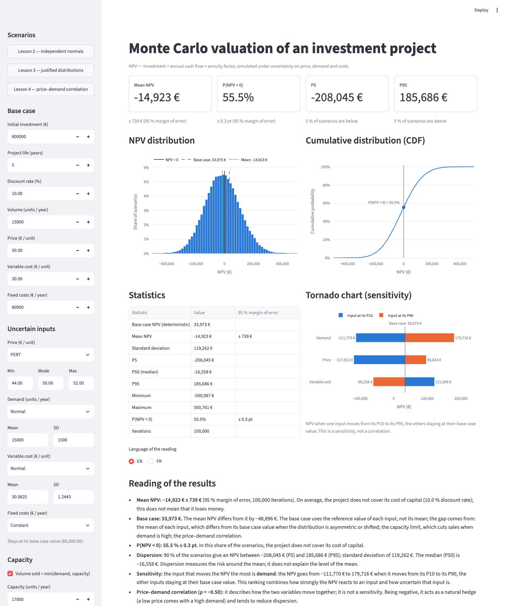

# Monte Carlo valuation of an investment project

[](https://monte-carlo-npv.streamlit.app/)

**Live demo — no installation needed:** <https://monte-carlo-npv.streamlit.app/>

A small tool that values an investment project under uncertainty. Instead of a
single net present value (NPV), it simulates thousands of scenarios and shows
the whole distribution of the NPV: its mean, its dispersion, and the
probability that the project does not cover its cost of capital.

We are two finance students (bachelor in Finance & Management Control). We
first built the model by hand in Excel, then specified this Python version and
validated it against our spreadsheet.



## What the tool does

- Computes the deterministic NPV of the project (base case).
- Simulates the NPV when price, demand and costs are uncertain, with a choice
  of distribution for each input: Constant, Normal, PERT, Triangular, Lognormal.
- Limits the volume sold to the production capacity.
- Correlates price and demand (Gaussian copula).
- Reports every simulated statistic with its margin of error.
- Ranks the inputs by their effect on the NPV (tornado chart).
- Writes a short reading of the results, in English or French.
- Exports the simulated draws as a CSV file.

## The case study

A 5-year project: 800,000 € invested in Year 0, then 15,000 units a year sold
at 50 €, with a variable cost of 30 € per unit, fixed costs of 80,000 € a year
and a 10 % discount rate. No tax, no working capital, no salvage value.

Annual cash flow = 15,000 × (50 − 30) − 80,000 = 220,000 €.
Base case NPV = −800,000 + 220,000 × 3.7908 = **33,973.09 €**.

The project is thin: its break-even price is 49.40 € and its break-even volume
14,552 units, both about 1 to 3 % away from the base case. This is why a
single NPV figure is not enough.

## Method

**One formula.** The cash flow is the same every year, so
NPV = −Investment + annual cash flow × annuity factor. One draw of the inputs
applies to the 5 years, and all scenarios are computed at once.

**Three steps of realism**, the same as in our Excel model:

| Step | Price | Demand | Variable cost | Other |
| --- | --- | --- | --- | --- |
| Lesson 2 | Normal(50, 2.5) | Normal(15,000, 1,500) | Normal(30, 1.5) | inputs independent |
| Lesson 3 | PERT(44, 50, 52) | Normal(15,000, 1,500) | Normal fitted on 8 historical values (mean 30.06, SD 1.24) | volume sold = min(demand, 17,000) |
| Lesson 4 | as lesson 3 | as lesson 3 | as lesson 3 | price–demand correlation ρ = −0.5 |

**Correlation.** A Gaussian copula: correlated standard normals are obtained
with the Cholesky factor of the correlation matrix, turned into probabilities,
then into each input through its own inverse cumulative distribution function.
The correlation matrix is checked (symmetric, unit diagonal, positive
semi-definite) before use.

**Margin of error.** A simulation is an estimate. The standard error of the
mean is SD / √N and that of a probability is √(p(1 − p) / N); the 95 % margin
is 1.96 standard errors.

## Results of the case study

Python, 100,000 iterations, seed 42. The 95 % margin is ± 1,252 €, ± 914 € and
± 739 € on the three means, and ± 0.3 point on the probabilities.

| Statistic | Lesson 2 | Lesson 3 | Lesson 4 |
| --- | ---: | ---: | ---: |
| Mean NPV | 35,201 € | −11,274 € | −14,923 € |
| Standard deviation | 201,941 € | 147,509 € | 119,262 € |
| P5 | −281,316 € | −252,994 € | −208,045 € |
| P95 | 381,506 € | 232,399 € | 185,686 € |
| P(NPV < 0) | 44.7 % | 53.1 % | 55.5 % |

How we read them:

- **Lesson 2.** The mean NPV equals the base case within the margin of error
  (inputs are independent and centred on the base case), but the NPV is
  negative in about 45 % of the scenarios. A negative NPV means the project
  does not cover its cost of capital, not that it loses money.
- **Lesson 3.** The mean falls by about 46,000 €. Three causes, in this order:
  the expert's price range is asymmetric (PERT mean 49.33 €, below the 50 €
  most likely value, ≈ −37,900 €); capacity cuts the sales of the best years
  (≈ −4,600 €); the historical mean cost is 30.06 € (≈ −3,500 €). Separately,
  the dispersion decreases because the price range is narrower than in lesson 2.
- **Lesson 4.** The negative correlation is a natural hedge: a low price tends
  to come with a high demand. The standard deviation drops from 147,509 € to
  119,262 €, while the mean moves by only about −3,600 €.

### Why the tornado chart ranks demand before price

In lesson 4 the tornado chart ranks demand first, although the NPV reacts more
to a 1 % change in price than to a 1 % change in demand. The swing of an input
is its **sensitivity multiplied by its uncertainty**:

| Input | NPV change for 1 % of the input | P10 to P90 range (% of base case) | Swing |
| --- | ---: | ---: | ---: |
| Demand | 11,372 € | 25.6 % | 291,485 € |
| Price | 28,431 € | 7.5 % | 214,553 € |
| Variable cost | 17,059 € | 10.6 % | 181,354 € |

Price is the most sensitive input, but the expert's price range is narrow;
demand is less sensitive but much more uncertain. In lesson 2, where the price
range is wider (12.8 %), price ranks first.

The tornado chart has three limits. It moves **one input at a time**, so it
shows no interaction between inputs. It **ignores the correlation**: with
ρ = −0.5 a low price would come with a high demand, which the chart does not
show. And it is **anchored on the base case**, which is not the mean of the
distributions: the capacity limit, for instance, is not reached when demand
alone moves to its P90 (16,922 units).

## Validation

- The base case matches the Excel model to the cent (33,973.09 €).
- Python is compared with Excel for each lesson, within the margin of error:
  28 of 30 comparisons fall within the 95 % margin, which is what chance alone
  predicts. See [docs/validation.md](docs/validation.md).
- With 1,000,000 iterations and three seeds, the mean NPV converges to its
  exact analytical value (33,973.09 € for lesson 2, −12,134 € for lesson 3).
- 79 automated tests cover the model, the distributions, the correlation, the
  statistics and the dashboard.

## How to run it

**Online.** Open the [live demo](https://monte-carlo-npv.streamlit.app/). The app goes to
sleep when nobody has visited it for a while (12 hours at the time of writing); one click
on "Yes, get this app back up!" restarts it in a moment.

**On your computer.** With [conda](https://docs.conda.io):

```bash
conda env create -f conda/environment.yml
conda activate montecarlo
streamlit run app.py      # opens the dashboard in the browser
pytest                    # runs the tests
python validate.py        # regenerates docs/validation.md
```

## Project layout

```
app.py                    Streamlit dashboard
montecarlo/model.py       deterministic NPV
montecarlo/distributions.py   input distributions
montecarlo/correlation.py correlation matrix checks, Cholesky, Gaussian copula
montecarlo/simulation.py  runs a simulation from a scenario
montecarlo/stats.py       statistics, standard errors, tornado
montecarlo/reading.py     written reading of the results (English, French)
scenarios/                one scenario per lesson, with its Excel references
tests/                    automated tests
validate.py               Python vs Excel comparison
docs/validation.md        comparison tables
docs/methodology.md       method, choices and limits (in French)
excel/                    our original Excel model
conda/environment.yml     conda environment for local development
requirements.txt          pinned versions, used by Streamlit Community Cloud
```

## Limitations

The model is deliberately simple. Its main limits:

- **One draw for the 5 years.** Price, demand and cost are drawn once and kept
  for the whole project. A bad draw is a bad project for 5 years; nothing
  averages out over time, so the dispersion of the NPV is at the high end of
  what a year-by-year model would give.
- **No tax and no net working capital (NWC).** Cash flow is the operating
  margin; there is no corporate tax, no depreciation tax shield and no
  investment in working capital.
- **Variable cost is independent** of price and demand. In reality costs and
  prices may move together (inflation) and unit cost may depend on volume.
- **Normal distributions are not truncated.** A Normal can in theory give a
  negative demand or cost. Here this would be 10 standard deviations from the
  mean, so it has no practical effect, but it would matter with wider inputs.
- **The price range comes from a single expert.** The PERT (44, 50, 52) is one
  person's judgement, and it drives the main result: most of the fall of the
  mean NPV in lesson 3 comes from its asymmetry.
- The variable cost distribution is fitted on only 8 observations, and the
  uncertainty on its estimated mean and standard deviation is ignored.
- The discount rate, the investment, the fixed costs, the capacity and the
  project life are certain; there is no salvage value and no managerial
  reaction (expanding, stopping) during the project.
- The Gaussian copula gives no extra dependence in extreme scenarios, and the
  correlation of −0.5 is an assumption, not an estimate.

## Deployment

The app is ready for [Streamlit Community Cloud](https://streamlit.io/cloud)
but is not deployed. To deploy it: push the repository to GitHub, create an
app from it on Community Cloud and choose `app.py` as the entry point.
Community Cloud installs the pinned versions of `requirements.txt`. The conda
file is kept in `conda/` on purpose: at the repository root it would take
priority over `requirements.txt`. Choose Python 3.13 in the advanced settings.

## How this project was built

We designed the model, chose the assumptions and built the reference
spreadsheet ourselves. The Python code was written with
[Claude Code](https://claude.com/claude-code), phase by phase, under our
specification; we validated each phase against our Excel model and the theory
before moving on. We do not present the code as hand-written by us: our work is
the financial model, the specification and the validation.
